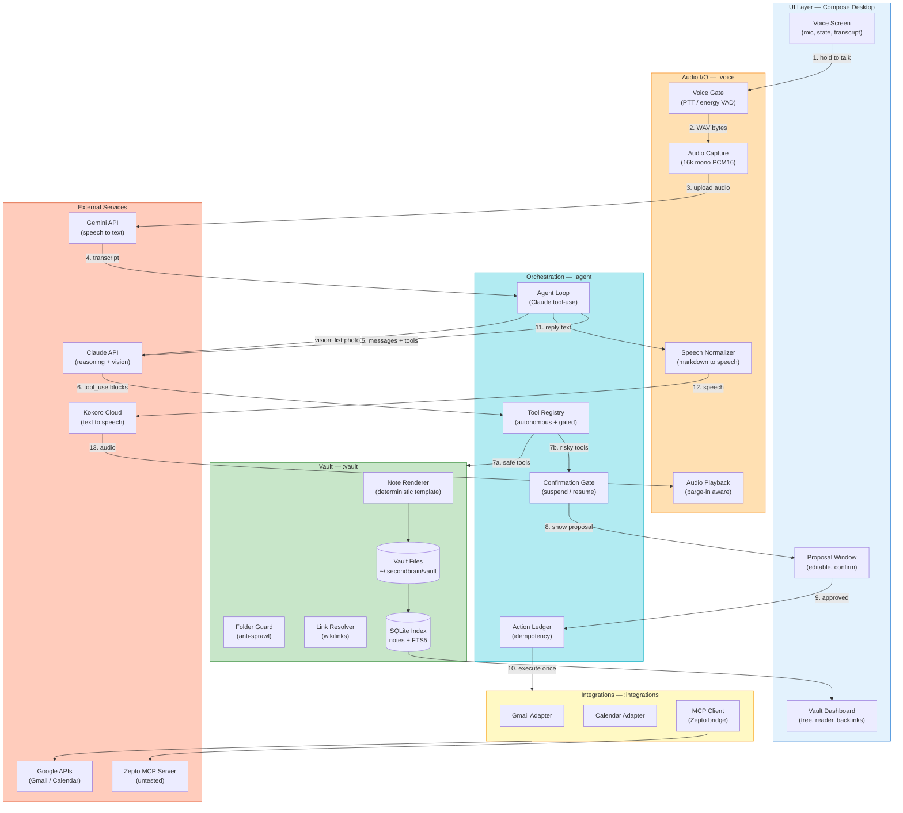
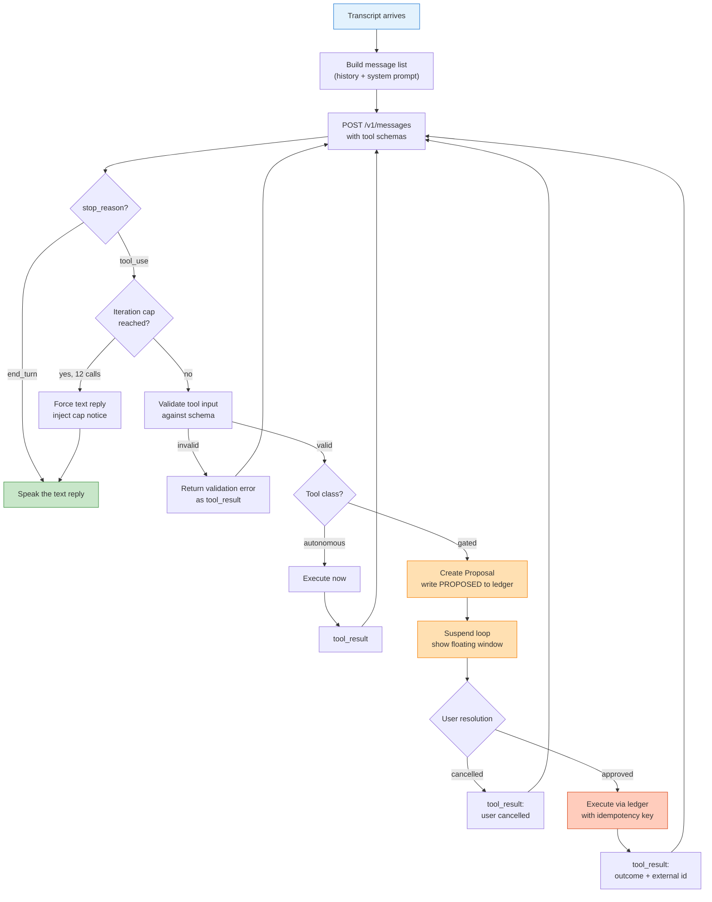
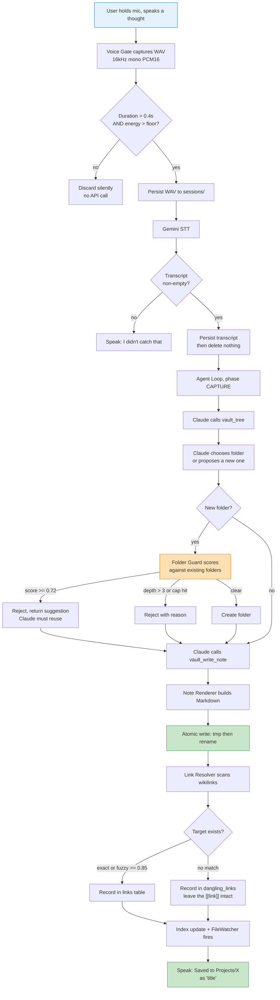
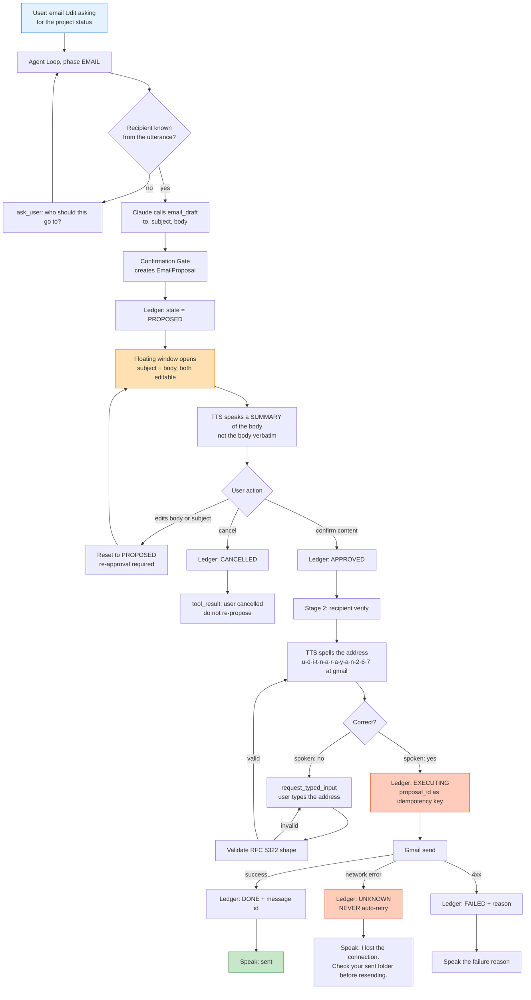
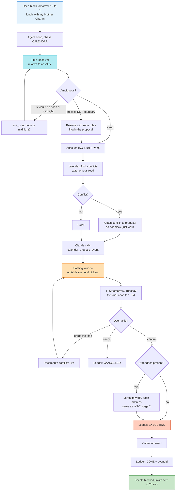
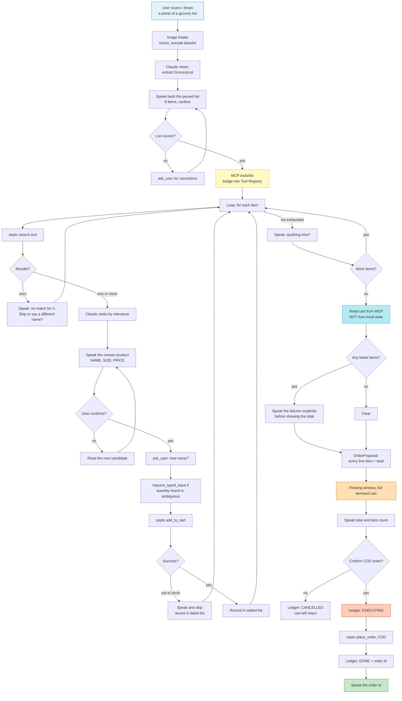
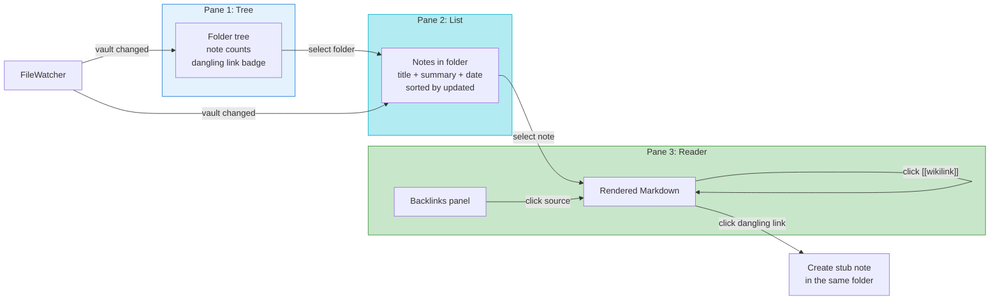

# Second Brain — Architecture

**Repository:** `second-brain` (standalone. BluePrint Lens / SDLC lives in its own repo and is integrated later, if ever.)
**Runtime:** Kotlin / JVM desktop (laptop). Compose Multiplatform UI.
**Status:** Design frozen for v1. Changes go through `DECISIONS.md`.

---

## 0. What this thing is

A voice-first assistant for someone who does not want to type. You speak, it thinks, it speaks back. Text and mouse exist only where speech is provably unreliable.

It does four jobs:

| # | Job | Blast radius |
|---|---|---|
| 1 | Capture a thought and file it as Markdown in a vault | Reversible |
| 2 | Draft and send email | **Irreversible** |
| 3 | Draft and create calendar events | **Irreversible** |
| 4 | Build a Zepto cart from a scanned list and place a COD order | **Irreversible, costs money** |

Jobs 2–4 never execute from voice alone. They produce a **Proposal** that surfaces as a floating window, and only a human action commits them. That single rule shapes most of this document.

### The 99% speech target, stated honestly

99% speech in / speech out is the goal, not an absolute. There are exactly two sanctioned exceptions, and they exist because ASR is unreliable on them and the cost of an error is high:

1. **Verbatim fields** — email addresses, phone numbers, exact quantities. Read back by TTS, corrected by typing.
2. **Confirmation clicks** — one button press per irreversible action.

Everything else is voice. If a feature request would add a third exception, it goes in `DECISIONS.md` with a justification.

---

## 1. System architecture



### Module layout & dependency direction

```
second-brain/
├─ CLAUDE.md
├─ ARCHITECTURE.md
├─ DECISIONS.md
├─ settings.gradle.kts
├─ build.gradle.kts
├─ gradle/libs.versions.toml
├─ model/            pure data classes. zero dependencies beyond kotlinx-serialization.
├─ ports/            interfaces only. depends on :model.
├─ vault/            filesystem, index, rendering. implements VaultStore.
├─ voice/            audio capture/playback, Gemini STT, Kokoro TTS.
├─ agent/            Claude client, tool registry, agent loop, confirmation gate.
├─ integrations/     Gmail, Calendar, MCP client, commerce adapter.
└─ app/              Compose UI + composition root + main().
```

**Allowed dependency edges, and no others:**

```
model  <-  ports
ports  <-  vault, voice, agent, integrations
model  <-  vault, voice, agent, integrations
vault, voice, agent, integrations  <-  app
```

`:agent` must **not** depend on `:vault`, `:voice`, or `:integrations`. It depends only on `:ports` and `:model`. `:app` is the only module that knows concrete implementations exist. Any PR that adds an edge outside this list is wrong.

### Why hexagonal here

Every external dependency in this system is either untested (Zepto MCP), likely to change (Kokoro endpoint shape, Gemini model strings), or something we may want to run offline (STT, TTS). Ports let each one be swapped or faked without touching the agent loop. This is not architecture astronomy — three of the six external services are genuinely unstable.

---

## 2. Storage layout

```
~/.secondbrain/
├─ config.toml            API keys, model strings, endpoints. NEVER committed.
├─ vault/                 the Markdown vault. app-private, but Obsidian-shaped.
│  ├─ Inbox/
│  ├─ Projects/
│  ├─ People/
│  └─ ...
├─ index.db               SQLite. DISPOSABLE. Rebuildable from vault/ at any time.
├─ app.db                 SQLite. PRECIOUS. Conversations, action ledger, OAuth tokens.
├─ sessions/              raw WAV + transcript per utterance. rotated at 30 days.
└─ logs/
```

**`index.db` is disposable, `app.db` is precious.** Never store anything in `index.db` that cannot be regenerated by re-walking `vault/`. Never store anything in `app.db` that would be catastrophic to lose without a backup path. Delete `index.db` freely during development; it is a cache.

### index.db schema

```sql
CREATE TABLE folders (
  path        TEXT PRIMARY KEY,      -- vault-relative, forward slashes
  name        TEXT NOT NULL,
  depth       INTEGER NOT NULL,
  note_count  INTEGER NOT NULL DEFAULT 0,
  created_at  TEXT NOT NULL
);

CREATE TABLE notes (
  path        TEXT PRIMARY KEY,      -- vault-relative, e.g. "Projects/Second Brain/idea.md"
  folder      TEXT NOT NULL REFERENCES folders(path),
  title       TEXT NOT NULL,
  slug        TEXT NOT NULL,
  summary     TEXT,
  tags        TEXT,                  -- JSON array
  created_at  TEXT NOT NULL,
  updated_at  TEXT NOT NULL,
  content_hash TEXT NOT NULL
);

CREATE VIRTUAL TABLE notes_fts USING fts5(
  title, summary, body, content='', tokenize='porter unicode61'
);

CREATE TABLE links (
  from_path   TEXT NOT NULL,
  to_path     TEXT NOT NULL,
  raw_target  TEXT NOT NULL,         -- what was literally inside [[ ]]
  PRIMARY KEY (from_path, raw_target)
);

CREATE TABLE dangling_links (
  from_path   TEXT NOT NULL,
  raw_target  TEXT NOT NULL,
  seen_at     TEXT NOT NULL,
  PRIMARY KEY (from_path, raw_target)
);

CREATE TABLE folder_decisions (       -- audit trail for the Folder Guard
  id          INTEGER PRIMARY KEY AUTOINCREMENT,
  proposed    TEXT NOT NULL,
  verdict     TEXT NOT NULL,          -- ACCEPTED | REJECTED_SIMILAR | REJECTED_DEPTH | REJECTED_CAP
  matched     TEXT,                   -- the existing folder we redirected to
  score       REAL,
  at          TEXT NOT NULL
);
```

### app.db schema

```sql
CREATE TABLE conversations (
  id          TEXT PRIMARY KEY,
  started_at  TEXT NOT NULL,
  ended_at    TEXT,
  phase       TEXT NOT NULL           -- see context reset policy
);

CREATE TABLE messages (
  id          INTEGER PRIMARY KEY AUTOINCREMENT,
  conv_id     TEXT NOT NULL REFERENCES conversations(id),
  role        TEXT NOT NULL,          -- user | assistant
  content     TEXT NOT NULL,          -- JSON content blocks, verbatim from/to the API
  tokens_in   INTEGER,
  tokens_out  INTEGER,
  at          TEXT NOT NULL
);

CREATE TABLE action_ledger (          -- the idempotency spine. see EC-E4, EC-Z8.
  proposal_id TEXT PRIMARY KEY,       -- UUID, generated when the proposal is created
  kind        TEXT NOT NULL,          -- EMAIL_SEND | CALENDAR_CREATE | ORDER_PLACE
  payload     TEXT NOT NULL,          -- JSON snapshot of exactly what was approved
  state       TEXT NOT NULL,          -- PROPOSED|APPROVED|EXECUTING|DONE|FAILED|CANCELLED|UNKNOWN
  external_id TEXT,                   -- gmail message id / gcal event id / zepto order id
  error       TEXT,
  created_at  TEXT NOT NULL,
  updated_at  TEXT NOT NULL
);

CREATE TABLE oauth_tokens (
  provider    TEXT PRIMARY KEY,       -- google
  access      TEXT NOT NULL,
  refresh     TEXT NOT NULL,
  expires_at  TEXT NOT NULL
);

CREATE TABLE cost_meter (
  id          INTEGER PRIMARY KEY AUTOINCREMENT,
  conv_id     TEXT,
  service     TEXT NOT NULL,          -- claude | gemini | kokoro
  units       REAL NOT NULL,
  usd         REAL NOT NULL,
  at          TEXT NOT NULL
);
```

---

## 3. The note format

Deterministic. **The model fills a `NoteDraft`; a Kotlin function renders the Markdown.** The model never emits raw file content. This is non-negotiable and mirrors the same rule from BluePrint Lens.

```markdown
---
title: Offline inference is the moat
created: 2026-09-01T14:32:11+05:30
updated: 2026-09-01T14:32:11+05:30
tags: [architecture, positioning]
source: voice
summary: Competitors need network round-trips; we don't. That's the pitch.
---

Competitors all need a network round-trip for inference. We don't.
That is the entire pitch and everything else is detail.

Relates to [[BluePrint Lens]] and the [[Competition Demo Plan]].
```

`NoteDraft` (in `:model`):

```kotlin
data class NoteDraft(
    val folder: String,          // vault-relative, validated by PathSafety + FolderGuard
    val title: String,           // human title, may contain spaces/punctuation
    val tags: List<String>,
    val summary: String,         // one sentence, used by the dashboard and search
    val bodyMarkdown: String,    // may contain [[wikilinks]]
    val source: NoteSource       // VOICE | TEXT | IMAGE
)
```

`NoteRenderer.render(draft, now): String` is a pure function. It has unit tests. It is the only thing in the codebase that produces `.md` bytes.

---

## 4. The agent loop

Claude's native tool-use loop is the orchestrator. There is no workflow engine, no state machine DSL, no LangGraph equivalent. Adding one would be a layer with no job.



### Tool classes

Every tool is declared **autonomous** or **gated** at registration time. There is no third class and no runtime promotion.

**Autonomous** — read-only, or writes that are cheap to undo inside our own vault:

| Tool | Purpose |
|---|---|
| `vault_tree` | Folder/file structure so Claude can choose placement. Depth-limited, count-summarised past a threshold. |
| `vault_read` | Read one note. |
| `vault_search` | FTS5 search over the vault. Used for wikilink targets and "what did I say about X". |
| `vault_create_folder` | Create a folder. **Intercepted by Folder Guard**, may be rejected. |
| `vault_write_note` | Render and write a note from a `NoteDraft`. |
| `vault_append_note` | Append to an existing note under a heading. |
| `vault_move_note` | Correct a bad placement. Records `moved_from` in frontmatter. |
| `calendar_find_conflicts` | Read-only busy check for a time range. |
| `ask_user` | Speak a clarifying question and wait for a spoken answer. |
| `request_typed_input` | Ask for a **verbatim field** by keyboard. The sanctioned typing escape hatch. |
| `zepto__search_*` | Any MCP tool classified as non-mutating. |

**Gated** — irreversible or externally visible:

| Tool | Produces |
|---|---|
| `email_draft` | `EmailProposal` |
| `calendar_propose_event` | `CalendarProposal` |
| `zepto__place_order` (and anything the Mutation Classifier flags) | `OrderProposal` |

There is **no** `email_send` tool. Sending is not something the model can call. It is something a human resolution causes. This distinction is the whole safety model — if you ever find yourself adding a direct-send tool "just for testing", stop.

### Context reset policy

Voice sessions ramble. Token growth is real. Policy:

- A conversation has a **phase**: `CAPTURE`, `EMAIL`, `CALENDAR`, `COMMERCE`, `QUERY`.
- Phase transitions are **hard context resets**. The new phase starts from the system prompt plus a one-paragraph carry-over summary, not the full history.
- Within a phase, keep a rolling window of the last 8 turns plus a running summary of anything older.
- After any gated action completes, the phase ends. Full reset.

This is the same discipline used in BluePrint Lens and for the same reason: soft windowing leaks stale intent into new decisions, and stale intent on a gated action is how you send the wrong email.

---

## 5. Workflows

### WF-1 — Capture a thought

The bread-and-butter path. Must be fast and must never require a click.



**The Folder Guard is the single most important quality component in this workflow.** Without it, an LLM given a `create_folder` tool will produce a vault with 90 top-level folders inside a week. Rules, all deterministic, all in `:vault`, none in the prompt:

1. Normalise the proposed name: lowercase, strip punctuation, singularise, tokenise.
2. Score against every existing folder: `0.6 * jaccard(tokens) + 0.4 * (1 - normalisedLevenshtein(slug))`.
3. If `max score >= 0.72` → **REJECT**, return `{"rejected": true, "reason": "SIMILAR", "use_instead": "<path>", "score": 0.81}`.
4. If depth would exceed 3 → **REJECT**, reason `DEPTH`.
5. If this is a new top-level folder and the top-level count is already 12 → **REJECT**, reason `CAP`, return the tree so Claude can nest it.
6. Every verdict is written to `folder_decisions` and shown in the dashboard.

Thresholds live in `VaultConfig`, not in the prompt. Tune them against real captures in Step 3, and log the change in `DECISIONS.md`.

---

### WF-2 — Send an email

Two-stage confirmation: content first, then recipient. The recipient stage is where typing is allowed.



**Approval invalidation rule.** Editing a **content** field (subject, body) invalidates content approval and returns to `PROPOSED`. Editing a **verbatim** field (recipient) during stage 2 does **not** invalidate content approval. Without this rule, correcting a mistyped address would force you to re-approve the body, and you would stop reading it.

**Read a summary, not the body.** The body is on screen. Speaking a 200-word email aloud is punishment. TTS says: *"Three sentences to Udit, asking for the current status of BluePrint Lens and whether the demo date has moved. It's on screen."*

---

### WF-3 — Block calendar time

Same gate machinery, different payload. The hard part is time, not the API.



**Time Resolver is deterministic Kotlin, not the model.** Claude extracts *intent* (`tomorrow`, `12`, `1`, `lunch`); `java.time` resolves it against the system zone. Letting an LLM emit absolute timestamps is how you get events in 2024. The resolver returns a `ResolvedTimeRange` with an `ambiguities: List<Ambiguity>` field; a non-empty list forces an `ask_user` before proposing.

**Never invent an attendee address.** If the user says "Charan" and no address was given and none is in the vault under `People/`, ask. Do not guess `charan@gmail.com` because it pattern-matches.

---

### WF-4 — Zepto grocery order

Highest blast radius, least tested dependency. Built last, behind an adapter, with a working fake.



**Dynamic tool bridging.** You asked for "every tool available in the MCP". Implementation:

1. On session start, call `tools/list` on the Zepto MCP server.
2. Map each MCP tool's JSON Schema into an Anthropic tool definition. Namespace as `zepto__<original_name>`.
3. Run each through the **Mutation Classifier**: name or description matching `/place|order|checkout|pay|submit|confirm|delete|cancel|remove/i` → **gated**. Everything else → autonomous.
4. Unknown tools default to **gated**. Fail closed. A read-only tool wrongly gated costs one extra click; a mutating tool wrongly autonomous costs money.
5. Log the full classification table at startup so you can see what it decided.

**Always re-read the cart from the server before proposing the order.** Local cart state drifts — the MCP may have pre-existing items, another session may have added things, an add may have partially succeeded. The proposal shows what the server says is in the cart, not what we think we added.

**Never silently substitute.** "Good Day biscuits" returning "Britannia Good Day Cashew 200g ₹45" must be read aloud with name, size and price before it goes in. Substituting a 60g for a 300g pack without saying so is exactly the failure that destroys trust in an assistant like this.

---

### WF-5 — Dashboard navigation



"Automatically redirect in the application" = clicking any `[[wikilink]]` navigates the reader to that note and syncs the tree/list selection to match. A dangling link renders visually distinct (dashed underline) and clicking it offers to create the stub. A graph view is explicitly **out of scope for v1** — the three-pane + backlinks view carries the same information with a tenth of the work.

---

## 6. Edge case catalogue

Referenced by ID from `CLAUDE.md` and from tests. Every one of these needs a test or an explicit "accepted risk" note in `DECISIONS.md`.

### Voice input

| ID | Case | Handling |
|---|---|---|
| EC-V1 | Silence or accidental trigger | Pre-flight check: duration ≥ 400ms **and** RMS energy above a calibrated floor. Discard below threshold with zero API cost. |
| EC-V2 | Mid-sentence pause causes premature endpointing | VAD silence timeout of 1200ms, not 500ms. Push-to-talk is the default mode precisely because it sidesteps this. |
| EC-V3 | User speaks while TTS is playing (barge-in) | Mic stays hot during playback. Detected speech immediately stops playback and starts capture. Playback state machine must be interruptible. |
| EC-V4 | ASR mangles emails, numbers, brand names | The **verbatim field** pattern. Never trust ASR for anything the user will be angry about getting wrong. |
| EC-V5 | English/Telugu/Hindi code-switching | Gemini handles it; transcripts may be mixed-script. Do not "clean" them. Pass through. Note titles get slugified but frontmatter `title` keeps the original. |
| EC-V6 | Recording exceeds inline audio size limit | Cap single utterance at 60s. Beyond that, chunk and stitch transcripts, or switch to the Files API. Decide during the Step 1 spike. |
| EC-V7 | Network drop mid-STT | **The WAV is persisted before the API call and is never deleted until the transcript is committed.** Retry with backoff. A dropped connection must not lose a thought. |
| EC-V8 | Homophone intent collision ("send" / "spend", "block" / "blog") | Never route on keyword matching. Claude classifies intent. Low-confidence intent → `ask_user`. |
| EC-V9 | Audio device disappears mid-session (unplugged headset) | Catch `LineUnavailableException`, re-enumerate devices, speak the error. Do not crash. |

### Speech output

| ID | Case | Handling |
|---|---|---|
| EC-T1 | Claude returns Markdown; TTS reads asterisks aloud | `SpeechNormalizer`: strip emphasis, convert bullets to "first / second / third", strip URLs to "a link", expand common abbreviations. |
| EC-T2 | Response too long to speak (3+ minutes) | Hard cap of ~60s of speech. Truncate at a sentence boundary and offer: *"There's more — want the rest, or is it on screen?"* |
| EC-T3 | Kokoro cold start latency | Speak sentence-by-sentence: send the first sentence as soon as the model produces it, queue the rest. Fill dead air with an audible "thinking" cue after 1.5s. |
| EC-T4 | Kokoro unreachable | Fall back to a local JVM TTS (FreeTTS/system) with a spoken warning, or degrade to on-screen text. Never fail silently. |
| EC-T5 | Reading email bodies verbatim | Forbidden. Speak a summary; the full text is on screen. |

### Agent loop

| ID | Case | Handling |
|---|---|---|
| EC-A1 | Infinite tool loop (repeated `vault_tree` calls) | Hard cap of 12 tool calls per turn. On cap, inject a system notice and force a text response. |
| EC-A2 | Claude proposes `../` or an absolute path | `PathSafety.resolve()` canonicalises against the vault root and rejects anything escaping it. Applied to **every** path-bearing tool argument, no exceptions. |
| EC-A3 | Claude calls a tool that doesn't exist | Return a structured `unknown_tool` error as `tool_result` with the valid tool list. Cap self-correction at 2 attempts. |
| EC-A4 | Malformed tool input | Validate against the JSON Schema before dispatch. Return field-level errors as `tool_result`. |
| EC-A5 | `vault_tree` on a 2000-note vault blows the context | Depth limit 3 by default. Folders past 20 notes return a count, not a listing. Response capped at ~2000 tokens. |
| EC-A6 | Context grows across a long voice session | Phase-boundary hard reset + 8-turn rolling window (§4). |
| EC-A7 | Claude API 429 / 529 | Exponential backoff with jitter, 3 attempts. On final failure, speak the error and preserve the transcript so nothing is lost. |
| EC-A8 | Two proposals open at once (email + calendar in one breath) | **One gate at a time.** The second gated tool call returns `gate_busy` as `tool_result`; Claude queues it and re-proposes after the first resolves. |
| EC-A9 | App killed with a pending proposal | On startup, any ledger row in `PROPOSED`/`APPROVED` is marked `CANCELLED`. Any row in `EXECUTING` is marked `UNKNOWN` and surfaced to the user. **Never auto-execute or auto-retry on restart.** |

### Vault

| ID | Case | Handling |
|---|---|---|
| EC-N1 | Two notes with the same title on the same day | Append ` 2`, ` 3` to the slug. Frontmatter `title` stays identical. |
| EC-N2 | Spoken title contains `/`, `:`, `?` | `Slugifier`: strip filesystem-illegal chars, collapse whitespace, cap at 80 chars. Original preserved in frontmatter. |
| EC-N3 | Concurrent write while the dashboard reads | Single-writer actor with a per-file mutex in `:vault`. All writes funnel through it. |
| EC-N4 | Crash mid-write leaves a truncated file | Write to `.tmp` in the same directory, `fsync`, then atomic `Files.move` with `ATOMIC_MOVE`. |
| EC-N5 | Claude files a note in the wrong folder | `vault_move_note` exists as an autonomous tool. Moves record `moved_from` in frontmatter so the history is visible. |
| EC-N6 | Folder sprawl | Folder Guard (§5, WF-1). The highest-priority quality control in the system. |
| EC-N7 | Dangling `[[wikilinks]]` | Recorded in `dangling_links`, badged in the dashboard, clickable to create a stub. The link text is never silently rewritten. |
| EC-N8 | Fuzzy link match picks the wrong target | Match only above 0.85 similarity. Below that, leave dangling. A wrong link is worse than no link. |
| EC-N9 | Near-duplicate thought captured twice | Before writing, `vault_search` the summary. If cosine/FTS similarity is very high, Claude offers to append to the existing note instead of creating a new one. |
| EC-N10 | User edits a note by hand outside the app | FileWatcher detects, re-indexes, recomputes links. `content_hash` guards against redundant re-index. |
| EC-N11 | `index.db` corrupted or schema-drifted | Delete and rebuild from `vault/`. Startup validates the schema version and rebuilds automatically on mismatch. |

### Email

| ID | Case | Handling |
|---|---|---|
| EC-E1 | Recipient misheard | Verbatim verification stage, TTS spells it character by character. |
| EC-E2 | User edits the body then approves | The **edited** payload is snapshotted to the ledger and sent. Never send the model's original draft after an edit. This is a real and easy bug. |
| EC-E3 | OAuth token expires mid-flow | Refresh transparently before execution. If refresh fails, the proposal stays `APPROVED` and the user is asked to re-auth; the draft is not lost. |
| EC-E4 | Approved, then the network dies during send | Ledger goes to `UNKNOWN`. **Never auto-retry.** Speak: *"I lost the connection. Check your sent folder before resending."* Silent duplicate emails are unacceptable. |
| EC-E5 | Multiple recipients / CC | Each address verified independently in stage 2. |
| EC-E6 | User cancels mid-gate | `tool_result` carries `cancelled_by_user: true`. The system prompt instructs Claude not to re-propose the same action without new user intent. |
| EC-E7 | Email address valid in shape but wrong person | Out of scope. This is why we spell it back. |
| EC-E8 | Body contains something the user didn't say | The body is always on screen and always editable before approval. Never a voice-only approval for content. |

### Calendar

| ID | Case | Handling |
|---|---|---|
| EC-C1 | "12" — noon or midnight? | Ambiguity detected by the resolver → `ask_user`. Never default. |
| EC-C2 | "tomorrow" spoken at 11:58 PM | Resolve against the timestamp of the **utterance**, not of the API call. Capture the utterance time at recording start. |
| EC-C3 | Event crosses a DST boundary | Store zone ID, not offset. `java.time.ZonedDateTime` handles it; the proposal displays the resolved local times so the user sees the truth. |
| EC-C4 | Slot already busy | Warn in the proposal window. Do **not** block — double-booking is sometimes intentional. |
| EC-C5 | "Lunch with Charan" and Charan has no known address | Ask. Never fabricate an address from a first name. |
| EC-C6 | User drags the time in the window | Conflicts recompute live. Time edits do not invalidate approval (time is what the window is for). |
| EC-C7 | End before start after an edit | Validate on every change; disable the confirm button with an inline reason. |
| EC-C8 | All-day vs timed event | Absence of a stated time means all-day. State it in the read-back so the user can correct it. |

### Zepto / commerce

| ID | Case | Handling |
|---|---|---|
| EC-Z1 | MCP server unreachable or auth expired | `CommerceAdapter` reports unavailable. **The parsed grocery list is written to the vault as a note first**, so nothing is lost. Retry is a separate user action. |
| EC-Z2 | Search returns zero results | Speak it, offer to skip or rephrase. Never substitute. |
| EC-Z3 | Search returns 20 results | Claude ranks; top candidate is read aloud with name, size, price. "No" walks to the next candidate. |
| EC-Z4 | Quantity ambiguity ("one packet") | If the product has multiple pack sizes, the size is part of the read-back. Ambiguous counts go through `request_typed_input`. |
| EC-Z5 | Item goes out of stock between search and add | Adapter returns the failure; item lands in the failed list and is announced before the total. |
| EC-Z6 | Price changed between add and order | Cart is re-read from the server before the proposal. The proposal shows server truth. |
| EC-Z7 | Cart already has items from a previous session | Re-read reveals them. The proposal shows the **full** cart, and pre-existing items are flagged as not-from-this-session. |
| EC-Z8 | Order placed, response lost | Ledger `UNKNOWN`. Never retry. Speak: *"I'm not sure that went through. Check the Zepto app before ordering again."* |
| EC-Z9 | COD unavailable for this cart or pincode | Detect before proposing. If COD is impossible, say so and stop — do not fall back to any payment method. |
| EC-Z10 | Partial add (6 of 8 items succeeded) | Failures are announced **before** the total, not buried after it. |
| EC-Z11 | MCP schema doesn't map cleanly to an Anthropic tool schema | Skip the tool, log it loudly at startup, continue with the rest. One bad schema must not kill the session. |
| EC-Z12 | An unclassifiable MCP tool | Defaults to **gated**. Fail closed. |
| EC-Z13 | Handwritten list is illegible | Claude vision returns per-item confidence. Low-confidence items are read back explicitly for confirmation before searching. |

### Config & cost

| ID | Case | Handling |
|---|---|---|
| EC-G1 | Missing or invalid API key | Fail fast at startup with a named, actionable error. Never a 401 discovered mid-conversation. |
| EC-G2 | Runaway cost | `cost_meter` logs every call. A configurable per-session USD ceiling speaks a warning and requires confirmation to continue. |
| EC-G3 | Model string deprecated | Model IDs live in `config.toml`, never hardcoded. A 404 on a model produces a clear message naming the config key. |
| EC-G4 | `config.toml` accidentally committed | `.gitignore` entry plus a pre-commit check. Keys never appear in logs, transcripts, or notes. |

---

## 7. Implementation plan — 7 steps

Sequenced so the riskiest untested dependency (Zepto MCP) is last, and so a working demo exists from Step 3 onward. **Do not start a step until the previous step's exit criteria pass.** Every step ends with a `DECISIONS.md` entry.

---

### Step 1 — Skeleton, config, and the voice loop (no LLM)

**Goal:** speak into the laptop and hear the machine repeat it. Nothing else. If this isn't solid, everything above it is unstable.

**Blocking spikes — do these before writing production code:**

| Spike | Question to answer | Written to |
|---|---|---|
| S1.1 | Gemini audio input: exact model string, inline size limit, accepted encodings, latency for a 10s clip | `DECISIONS.md` |
| S1.2 | Kokoro Cloud: exact endpoint, request/response shape, output sample rate, whether streaming is supported | `DECISIONS.md` |
| S1.3 | JVM audio: does `TargetDataLine` give clean 16kHz mono PCM16 on this laptop, and what's the device enumeration story | `DECISIONS.md` |

Do not proceed on assumptions for any of these three. Each is a hard external contract.

**Build:**

- Gradle multi-module setup: `settings.gradle.kts`, root `build.gradle.kts`, `gradle/libs.versions.toml` with all seven modules declared and the dependency edges from §1 enforced.
- `:model` — `AppConfig`, `Utterance`, `Transcript`, `SpeechRequest`, `AudioFormatSpec`.
- `:ports` — `SttPort`, `TtsPort`, `AudioCapturePort`, `AudioPlaybackPort`.
- `:voice`:
  - `JvmAudioCapture` — `TargetDataLine`, 16kHz mono PCM16, WAV framing, device enumeration with fallback.
  - `JvmAudioPlayback` — `SourceDataLine`, **interruptible** (`stop()` must cut playback within 100ms for EC-V3).
  - `VoiceGate` — two modes. `PushToTalk` (default, reliable) and `EnergyVad` (silence timeout 1200ms). Mode in config.
  - `GeminiStt` — Ktor client, inline base64 audio, retry with backoff.
  - `KokoroTts` — Ktor client, sentence-level chunking, returns a stream of audio buffers.
  - `SpeechNormalizer` v1 — markdown stripping, bullet-to-ordinal, URL elision, abbreviation expansion.
- Config: `~/.secondbrain/config.toml` loaded at startup, env var override, **fail-fast validation** of every required key (EC-G1). Add `config.toml` to `.gitignore` before writing a single key (EC-G4).
- Session persistence: every utterance writes `sessions/<ts>/audio.wav` then `sessions/<ts>/transcript.txt`. Audio is deleted only after the transcript commits (EC-V7).
- CLI harness in `:voice` with a `main()` — hold space, speak, see the transcript, hear it back.

**Exit criteria:**
- `./gradlew :voice:run` — speak a sentence, transcript is correct, TTS reads it back.
- Per-stage latency logged: capture → STT → TTS → first audio out.
- EC-V1 verified: silence produces zero API calls.
- EC-V3 verified: speaking during playback cuts the audio.
- EC-V9 verified: unplugging a headset mid-session does not crash.

---

### Step 2 — Vault core (still no LLM)

**Goal:** a fully tested, deterministic Markdown vault engine. Pure Kotlin, no network, no model. This is the part that must never lose data, so it gets built and tested in isolation before anything non-deterministic touches it.

**Build (`:vault`):**

- `VaultRoot` — resolves `~/.secondbrain/vault`, creates on first run, seeds `Inbox/`.
- `PathSafety` — canonicalise-and-verify against the root. Rejects `..`, absolute paths, symlink escapes. **Every path-bearing argument goes through this.** (EC-A2)
- `Slugifier` — illegal char stripping, whitespace collapse, 80-char cap, collision suffixing. (EC-N1, EC-N2)
- `NoteRenderer` — `render(draft: NoteDraft, now: Instant): String`. Pure. YAML frontmatter + body. The **only** producer of `.md` bytes in the codebase.
- `FolderGuard` — the scoring algorithm from §5 WF-1. Thresholds in `VaultConfig`. Every verdict written to `folder_decisions`. (EC-N6)
- `LinkResolver` — parse `[[...]]`, exact match then fuzzy ≥ 0.85, populate `links` / `dangling_links`. Never rewrites link text. (EC-N7, EC-N8)
- `AtomicWriter` — tmp + fsync + `ATOMIC_MOVE`. (EC-N4)
- `VaultWriter` — single-writer actor, per-file mutex, all mutations funnel through it. (EC-N3)
- `VaultIndex` — sqlite-jdbc, schema from §2, FTS5, schema-version check with auto-rebuild. (EC-N11)
- `FileWatcher` — `WatchService` on the vault root, debounced 300ms, triggers re-index. (EC-N10)

**Exit criteria:**
- 40+ unit tests, all green. Required coverage:
  - Path traversal: `../../etc/passwd`, `/etc/passwd`, `Projects/../../..`, symlink escape.
  - Slug collisions: three notes, same title, same day.
  - Folder Guard: "Project" vs "Projects" rejects; "Recipes" vs "Architecture" accepts; depth-4 rejects; 13th top-level rejects.
  - Link resolution: exact hit, fuzzy hit at 0.9, near-miss at 0.8 stays dangling.
  - Atomic write: kill between tmp-write and move, verify no partial file.
- `index.db` can be deleted and fully rebuilt from `vault/` with identical contents.

---

### Step 3 — Agent loop + vault tools (the walking skeleton)

**Goal:** the demo-critical milestone. Speak a thought, it lands in the right folder as a well-formed note, and the machine tells you where it put it. End to end, voice only.

**Build (`:agent`):**

- `ClaudeClient` — Ktor, `POST /v1/messages`, full tool-use support, streaming for first-sentence TTS latency, backoff on 429/529. (EC-A7)
- `ToolSpec` / `ToolRegistry` — registration declares the class (`AUTONOMOUS` / `GATED`) at construction. JSON Schema per tool.
- `ToolDispatcher` — schema validation before dispatch, structured errors as `tool_result`, unknown-tool handling. (EC-A3, EC-A4)
- `AgentLoop` — the flow in §4. Iteration cap of 12. (EC-A1)
- `ConversationStore` — `app.db` persistence, phase tracking, 8-turn window + rolling summary, hard reset on phase boundary. (EC-A6)
- `CostMeter` — logs every call to `cost_meter`, session ceiling with a spoken warning. (EC-G2)
- System prompt v1 — placement rules, one-note-per-thought, wikilink conventions, "ask rather than guess" instruction.
- Wire the vault tools: `vault_tree` (depth-limited, count-summarised — EC-A5), `vault_read`, `vault_search`, `vault_create_folder`, `vault_write_note`, `vault_append_note`, `vault_move_note`.
- Wire `ask_user` — speak the question, capture the spoken answer, return as `tool_result`.
- Duplicate detection: before `vault_write_note`, search for near-duplicates and offer append. (EC-N9)

**Exit criteria — this is the quality gate for the whole product:**
- Dictate **20 varied real thoughts** into an empty vault.
- Every note has valid frontmatter and parses cleanly.
- Total folder count after 20 captures is **≤ 8**. If it's higher, tune the Folder Guard threshold and re-run. Do not proceed with a sprawling vault.
- Manual review: at least 17 of 20 notes are in a folder you'd have chosen yourself.
- Zero path-traversal escapes, zero crashes, zero lost transcripts.
- Cost meter reports a per-capture USD figure. Record it in `DECISIONS.md` — it sets the budget for everything after.

---

### Step 4 — Dashboard UI

**Goal:** see the vault. Two screens, live-updating.

**Build (`:app`):**

- Compose Multiplatform desktop app, window + navigation rail with two destinations.
- **Voice screen:**
  - Large mic control (hold-to-talk), keyboard shortcut.
  - Prominent state indicator: `Idle` / `Listening` / `Thinking` / `Speaking`. The user must never wonder whether it heard them.
  - Scrolling transcript log — user turns and assistant turns.
  - Cost meter readout for the session.
- **Vault screen:** three panes per §5 WF-5.
  - Tree with note counts and a dangling-link badge per folder.
  - Note list sorted by `updated_at`, showing title + summary + date.
  - Markdown reader. `[[wikilinks]]` are clickable and navigate in place, syncing tree and list selection.
  - Backlinks panel below the reader.
  - Dangling links render dashed; clicking offers stub creation.
- FileWatcher → UI state flow, so a capture on screen 1 appears on screen 2 with no restart.
- Folder Guard audit view: a collapsible panel showing recent `folder_decisions`. You will need this to tune the thresholds.

**Exit criteria:**
- Capture a note by voice; it appears in the dashboard within 2 seconds.
- Clicking a wikilink navigates correctly and syncs the tree.
- Backlinks are correct for a note with 3+ inbound links.
- Editing a note in an external editor updates the dashboard.

---

### Step 5 — Confirmation gate + email

**Goal:** the first irreversible action, with the safety machinery that all the rest reuse. Build the gate properly here and Steps 6 and 7 become mostly plumbing.

**Build:**

- `:model` — `Proposal` (sealed: `EmailProposal`, `CalendarProposal`, `OrderProposal`), `Resolution` (`Approved`/`Edited`/`Cancelled`), `FieldKind` (`CONTENT` / `VERBATIM`).
- `:agent`:
  - `ConfirmationGate` — suspends the loop, emits the proposal, awaits resolution. One gate at a time; concurrent gated calls return `gate_busy`. (EC-A8)
  - `ActionLedger` — the state machine from §2. `proposal_id` is the idempotency key. Startup reconciliation marks orphaned rows `CANCELLED` / `UNKNOWN`. **No auto-retry, ever.** (EC-A9, EC-E4)
  - Approval invalidation rule: content edits reset to `PROPOSED`; verbatim edits do not. (§5 WF-2)
- `:app` — `ProposalWindow` composable overlaying the Voice screen. Editable fields, per-field validation, confirm/cancel. Confirm disabled with an inline reason when validation fails.
- `request_typed_input` tool — the verbatim escape hatch. Focused text field, spoken prompt, shape validation.
- `:integrations` — `GmailAdapter`:
  - OAuth 2.0 loopback flow (opens a browser once), token store in `app.db`, transparent refresh. (EC-E3)
  - `send(payload, idempotencyKey)`.
- `email_draft` gated tool. TTS reads a **summary** of the body, then spells the recipient character by character in stage 2. (EC-T5, EC-E1)

**Exit criteria:**
- Full voice-driven email, end to end.
- **Deliberately test the correction path:** have it mis-hear a recipient, correct it by typing, confirm the corrected address receives it.
- **Deliberately test the edit path:** edit the body in the window, approve, confirm the *edited* text was sent, not the draft. (EC-E2)
- Kill the app while a proposal is open; on restart the ledger shows `CANCELLED` and nothing was sent.
- Cancel at both stages; verify Claude does not immediately re-propose.
- Ledger shows exactly one `DONE` row per email. Zero duplicates across 10 sends.

---

### Step 6 — Calendar

**Goal:** the second gated workflow. Reuses Step 5 entirely; the new work is time.

**Build:**

- `:vault` or `:model` — `TimeResolver`:
  - Relative expressions → absolute `ZonedDateTime` using `java.time`. Resolved against the **utterance timestamp**. (EC-C2)
  - Returns `ResolvedTimeRange(start, end, zoneId, ambiguities: List<Ambiguity>)`.
  - Ambiguity detection for bare hours (12 = noon or midnight), missing dates, missing durations. Non-empty ambiguities force `ask_user`. (EC-C1)
  - DST-correct across boundaries. Zone ID stored, never a fixed offset. (EC-C3)
  - Unit tested hard: 30+ cases including "tomorrow" at 23:58, spring-forward, fall-back, "next Tuesday" on a Tuesday.
- `:integrations` — `CalendarAdapter`: `findBusy(range)`, `insert(event, idempotencyKey)`. Reuses the Google OAuth token from Step 5.
- Tools: `calendar_find_conflicts` (autonomous), `calendar_propose_event` (gated).
- `:app` — calendar variant of `ProposalWindow`: date/time pickers, live conflict recomputation on edit, end-before-start validation. (EC-C6, EC-C7)
- Attendee addresses go through the same verbatim verification as email recipients. Never fabricate one from a first name. (EC-C5)
- All-day vs timed distinction stated explicitly in the read-back. (EC-C8)

**Exit criteria:**
- *"Block tomorrow 12 to 1 for lunch with my brother Charan, charan@gmail.com"* produces a window with the correct absolute local time, a conflict warning if one exists, editable pickers, then attendee verification, then a created event with an invite.
- Say just *"block 12"* → it asks noon or midnight.
- Drag the time to overlap an existing event → the conflict warning appears live.
- Ledger discipline identical to Step 5: exactly one event per confirmation.

---

### Step 7 — Zepto MCP + grocery ordering

**Goal:** the highest-risk workflow, last, behind an adapter, with a working fake so a demo is never hostage to an untested third-party endpoint.

**Blocking spike before any production code:**

| Spike | Question | Fallback if it fails |
|---|---|---|
| S7.1 | Does the Zepto MCP endpoint respond to `tools/list`? What transport — SSE, streamable HTTP? What auth? | Ship with `FakeCommerceAdapter` for the demo and note it explicitly. |
| S7.2 | Do the returned tools actually cover search → add to cart → read cart → place order with COD? | If ordering is missing, scope down to cart building and hand off to the app. |

**Build:**

- `:integrations` — MCP client. Prefer the official Kotlin MCP SDK if it fits; otherwise a hand-rolled JSON-RPC 2.0 client over the server's transport. MCP is JSON-RPC; a minimal client is roughly 300 lines and removes a dependency risk on a deadline.
- **Dynamic tool bridge** — `tools/list` → Anthropic tool definitions, namespaced `zepto__*`. Schemas that don't map are skipped and logged loudly. (EC-Z11)
- **Mutation Classifier** — regex over name and description; unknown defaults to **gated**. Full classification table logged at startup. (EC-Z12)
- `CommerceAdapter` port + two implementations: `McpCommerceAdapter` and `FakeCommerceAdapter` (deterministic catalogue, seeded stock-outs and price changes, so every edge case is testable offline).
- `ImageIntake` — file drop and file picker on the Voice screen. Resize to Claude's vision limits, base64.
- `GroceryList` extraction via Claude vision, with per-item confidence. Low-confidence items read back before searching. (EC-Z13)
- **The parsed list is written to the vault as a note before any commerce call**, so an MCP failure never loses it. (EC-Z1)
- Per-item loop per §5 WF-4: search → rank → read back **name, size, price** → confirm → quantity → add. Failures collected, never silently skipped.
- Cart re-read from the server before proposing. (EC-Z6, EC-Z7)
- `OrderProposal` window: full itemised cart, pre-existing items flagged, failed items shown **above** the total, COD availability checked before proposing. (EC-Z9, EC-Z10)
- Gated `place_order` through the same ledger. `UNKNOWN` on lost response, no retry. (EC-Z8)

**Exit criteria:**
- Against `FakeCommerceAdapter`: a 5-item list produces a cart matching the list, with a seeded stock-out correctly announced before the total.
- Against the real MCP (if S7.1 passed): the same flow, with a real order id.
- A demo toggle switches adapters and is **visibly labelled in the UI** when the fake is active. Never demo a fake without saying so.
- Zero silent substitutions across 10 runs — every added product was read aloud with name, size and price first.

---

## 8. What is deliberately out of scope for v1

Written down so it doesn't creep back in:

- Graph view of the vault. Three-pane + backlinks carries the same information.
- Obsidian mobile interop / SAF / any external sync. App-private storage only.
- Offline / on-device inference. Everything is cloud in v1. The port structure makes this swappable later; do not build for it now.
- Wake-word ("hey brain"). Push-to-talk is the default, energy VAD is the option.
- Multi-user, multi-vault.
- Any payment method other than cash on delivery.
- Android packaging. Compose Multiplatform keeps the door open; do not walk through it yet.
- Integration with the BluePrint Lens / SDLC repo.

---

## 9. Open risks

| Risk | Impact | Mitigation |
|---|---|---|
| Zepto MCP endpoint untested | WF-4 may not be buildable | Adapter + fake. Step 7 is last, so a failure costs one workflow, not the project. |
| Kokoro endpoint contract unknown | Voice output blocked at Step 1 | Blocking spike S1.2. Local JVM TTS fallback. |
| Folder Guard thresholds unvalidated | Vault sprawl or over-merging | Step 3 exit criteria measure it on 20 real captures. Thresholds are config, not code. |
| Round-trip latency (STT + Claude + TTS) may feel slow | Kills the "lazy user" premise | Step 1 measures each stage. Streaming first-sentence TTS is the main lever. If total exceeds ~4s, revisit. |
| Cost per voice turn unknown | Budget surprise | `CostMeter` from Step 3. Session ceiling. |
| Gemini STT accuracy on Indian English / code-switching | Bad transcripts poison everything downstream | Measure in Step 1 with real speech, not read-aloud test sentences. |
| Claude vision on handwritten grocery lists | WF-4 intake unreliable | Per-item confidence + read-back. Typed fallback for the whole list. |
